<a href="https://www.linkedin.com/in/manikandanaerox"><b>LinkedIn</b></a>
&nbsp;·&nbsp;
<a href="mailto:manikandan.mechx@gmail.com"><b>manikandan.mechx@gmail.com</b></a>
&nbsp;·&nbsp;
Poitiers, France

 

I'm a second-year MSc student in Aeronautics and Space at **ISAE-ENSMA**, majoring in propulsion and energetics, with a background in mechanical engineering. My work has two sides. One is **propulsion and thermal systems**: engine cycles, combustion, supersonic flow and two-phase heat transfer. The other is **autonomous aircraft**, which I've spent four years designing, building and flying.

I'm looking for a **six-month internship from March 2027** in propulsion, energetics, thermal engineering, CFD or autonomous aerial systems.

 

## Propulsion & Energetics

**ATREX precooled air-breathing engine** &nbsp;April 2026 
A full thermodynamic cycle of a liquid-hydrogen ATREX engine at 12,000 m and Mach 3, covering intake, precooler, compressor map, combustor, heat exchanger, turbine and nozzle. From thrust, specific impulse and efficiencies I built the flight domain under thrust, drag and temperature limits. It shows that a four-engine vehicle can reach **30 km at Mach 5–6**.

<table>
<tr>
<td width="50%" valign="top">

  
<b>H₂/O₂ combustion thermochemistry</b> 
Python · Cantera  
Stoichiometric hydrogen–oxygen combustion under rocket conditions: adiabatic flame temperature, chemical equilibrium and dissociation from 0.1 to 10⁴ MPa, cross-checked against an analytical estimate of 3,498 K.
</td>
<td width="50%" valign="top">

  
<b>Supersonic CFD</b> 
STAR-CCM+  
A double-wedge airfoil at Mach 4, run inviscid and with Spalart–Allmaras turbulence to separate wave drag from viscous drag. Also a Busemann biplane at incidence, and nozzle flows at pressure ratios of 8 and 12.
</td>
</tr>
<tr>
<td width="50%" valign="top">

  
<b>Research Intern, two-phase heat transfer</b> 
Institut Pprime (CNRS · Université de Poitiers · ISAE-ENSMA) · March – July 2026  
Experimental work on loop thermosyphons for passive thermal management. I refined the rig for accuracy and repeatability, ran high-speed visualisation alongside temperature, pressure and mass-flow measurements, and wrote MATLAB routines for thermal resistances and heat-transfer coefficients. I'm co-authoring a manuscript on how heat transfer and flow instabilities interact; it is under internal review.
</td>
<td width="50%" valign="top">
<b>Also</b>  
<b>Transient conduction in a sphere.</b> An explicit finite-volume solver in spherical coordinates with angle-dependent surface convection. I derived its stability limit by von Neumann analysis and validated it with mesh refinement.  
<b>Automated thermal test interface.</b> A MATLAB and Fortran application for multi-sensor acquisition, live visualisation and automatic post-processing.  
<b>Coursework.</b> Propulsion systems, combustion and thermochemistry, gas dynamics, heat transfer, fluid mechanics, numerical methods and instrumentation.
</td>
</tr>
</table>

## Autonomous Flight

## Experience

| Year | Role | Where |
|:--|:--|:--|
| **2025 – 2027** | MSc Aeronautics & Space, Propulsion & Energetics | *ISAE-ENSMA, Poitiers* |
| **2026** | Research Intern, two-phase heat transfer | *Institut Pprime, Poitiers* |
| **2025 – now** | Propulsion & UAV Systems Engineer | *ENSMAERO, Dassault UAV Challenge* |
| **2024 – 2025** | R&D Engineering Intern, VTOL design | *Team Reconnaissance, Chennai* |
| **2024** | Automation & Systems Integration Intern | *Loyola-ICAM, Chennai* |
| **2023** | Wind Turbine Technician Intern | *Litewind Ltd, Chennai* |
| **2023** | CMM Programmer Intern | *Unique Measurement Service, Chennai* |
| **2021 – 2025** | B.E. Mechanical Engineering | *Loyola-ICAM College of Engineering & Technology, Chennai* |

**Recognition.** Jury's Favourite Award, Dassault UAV Challenge 2026 · Award winner, SAE Autonomous Drone Development Challenge 2024 · EU-certified drone pilot (DGAC, A1/A3)

**Beyond the lab.** Joint Secretary of the ISHRAE Chennai Chapter (500+ members) · 3D Printing Student Lead at the LICET Fablab

**Languages.** English (fluent) · French (A2) · Tamil (native)

## Toolkit

| Area | Tools & methods |
|:--|:--|
| **Programming** | Python (NumPy, SciPy, Pandas, Matplotlib), MATLAB, C/C++, Fortran |
| **Simulation** | STAR-CCM+, ANSYS Fluent, Cantera, finite-volume methods, Gazebo, ArduPilot SITL |
| **Thermal & propulsion** | Heat transfer, two-phase systems, cycle analysis, combustion thermochemistry, gas dynamics, instrumentation |
| **Design & manufacturing** | CATIA, SolidWorks, Fusion 360, FEA, 3D printing, CMM inspection |
| **Flight systems** | Pixhawk Cube Orange, Holybro, SpeedyBee F405, ArduPilot, MAVLink, QGroundControl, Mission Planner, Jetson Nano, ESP32 |

*Working on something that flies, burns or moves heat? I'd be glad to hear about it.*

<a href="https://www.linkedin.com/in/manikandanaerox">linkedin.com/in/manikandanaerox</a> &nbsp;·&nbsp; manikandan.mechx@gmail.com

