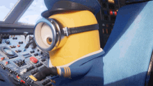
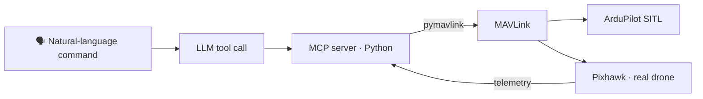

<div align="center">


&nbsp;&nbsp;


<sub><code>ignition sequence start…</code></sub>


<a href="https://www.linkedin.com/in/manikandanaerox"></a> <a href="mailto:manikandan.mechx@gmail.com"></a>  

</div>

<br/>

```yaml
callsign:   manikandanaerox
status:     M2 MSc Aeronautics & Space, Propulsion & Energetics @ ISAE-ENSMA
background: Mechanical engineering → aerospace
two sides:  [propulsion & thermal systems, autonomous drones]
seeking:    6-month internship from March 2027
domains:    propulsion · energetics · thermal engineering · CFD · autonomous aerial systems
```


## 🔥 Propulsion & Energetics


**ATREX precooled air-breathing engine: cycle and flight-domain analysis** · *Apr 2026*
Full thermodynamic cycle of a liquid-hydrogen ATREX engine at **12,000 m and Mach 3**: intake, precooler, compressor map, combustion chamber, heat exchanger, turbine and nozzle. I computed thrust, specific impulse and efficiencies, then built the flight domain under thrust, drag and temperature limits. Result: a **four-engine vehicle can reach 30 km at Mach 5–6**.

<table>
<tr>
<td width="50%" valign="top">


**H₂/O₂ combustion thermochemistry** · *Python, Cantera*
Stoichiometric H₂/O₂ combustion under rocket-propulsion conditions: adiabatic flame temperature, chemical equilibrium and dissociation from **0.1 to 10⁴ MPa**, cross-checked against an analytical estimate (**3,498 K**).
</td>
<td width="50%" valign="top">


**Supersonic CFD** · *STAR-CCM+*
A double-wedge airfoil at **Mach 4**, run inviscid (Euler) and viscous turbulent (Spalart–Allmaras) to separate wave drag from viscous drag, plus thickness and trailing-edge effects. I also modelled a Busemann biplane at incidence and nozzle flows at NPR 8 and 12.
</td>
</tr>
<tr>
<td width="50%" valign="top">


**Research Intern, Two-Phase Heat Transfer** · *Institut Pprime (CNRS · Univ. Poitiers · ISAE-ENSMA), Mar–Jul 2026*
Experimental research on two-phase loop thermosyphons for passive thermal management. I improved the rig's accuracy and repeatability and ran high-speed visualisation alongside T, P and ṁ measurements. I wrote MATLAB routines for heat-transfer rates, thermal resistances and HTCs (Nu, Re, Pr), then studied how heat transfer couples with flow instabilities. A manuscript I'm co-authoring is under internal review.
</td>
<td width="50%" valign="top">

**More from the lab bench** 🧪

- **Transient heat conduction in a sphere.** I wrote an explicit finite-volume solver in spherical coordinates with angle-dependent surface convection, derived its stability limit by von Neumann analysis and checked it with mesh refinement.
- **Automated thermal test interface** (*MATLAB, Fortran*). A GUI for multi-sensor acquisition, live plots and automated post-processing.
- **Coursework:** propulsion systems, combustion & thermochemistry, gas dynamics, heat transfer, fluid mechanics, numerical methods, instrumentation.

</td>
</tr>
</table>


## 🛩️ Autonomous Flight


| | Project | What I did |
|---|---|---|
| 🏆 | **Dassault UAV Challenge 2026** · ENSMAERO, ISAE-ENSMA<br/><sub>Propulsion & UAV Systems Engineer · Oct 2025 – now</sub> | **Jury's Favourite Award** (*Prix Coup de cœur du jury*) among 28 teams with a modular autonomous **VTOL 4+1, 2 m span**. I did the propulsion design and CFD optimisation, integrated sensors with a SpeedyBee F405, and wrote control algorithms in Python/C++ that we validated in ground and flight tests. |
| 🔥 | **Team Phoenix**, founder & captain · Team Turbonites LICET<br/><sub>Nov 2022 – Aug 2025</sub> | Founded and led a **20-member UAV team** that won an award at the **SAE Autonomous Drone Development Challenge 2024** (payload category). Took drones from CAD (SolidWorks) through FEA, 3D printing and flight test, with FC/IMU/GPS integration and Gazebo simulation. **100+ flight hours** as pilot. |
| 🛰️ | **VTOL R&D Intern** · Team Reconnaissance, HTBI Chennai<br/><sub>Jul 2024 – Mar 2025</sub> | Built autonomous VTOLs on a Holybro FC with an NVIDIA Jetson Nano companion computer. Ran flight-test campaigns and wrote Python pipelines (NumPy/Pandas/Matplotlib) for the flight data. Tuned mission planning for fixed-wing and multirotor platforms. |
| 🤖 | **Pixhawk MCP Server** · *ongoing* | A Python server that turns LLM tool calls into **MAVLink** commands (pymavlink) for Pixhawk/ArduPilot: telemetry, arm, take-off, GPS waypoints, land, RTL. Tested in ArduPilot SITL. |
| 🎛️ | **Custom quadcopter flight controller** | My own FC with **automatic PID tuning** of the control loops, so a quad is ready to fly once it's set up. |




## 🧭 Flight Log

| When | Role | Where |
|---|---|---|
| 2025 – 2027 | 🎓 **MSc Aeronautics & Space, Propulsion & Energetics (M2)** | ISAE-ENSMA · Poitiers, FR |
| Mar – Jul 2026 | 🔬 Research Intern, two-phase heat transfer | Institut Pprime · Poitiers, FR |
| Oct 2025 – now | ✈️ Propulsion & UAV Systems Engineer | ENSMAERO / Dassault UAV Challenge |
| Jul 2024 – Mar 2025 | 🛠️ R&D Engineering Intern, VTOL design | Team Reconnaissance, HTBI · Chennai, IN |
| Feb – Apr 2024 | ⚙️ Automation & Systems Integration Intern | Loyola-ICAM (LICET) · Chennai, IN |
| Jul 2023 | 🌬️ Wind Turbine Technician Intern | Litewind Ltd · Chennai, IN |
| Jun – Jul 2023 | 📐 CMM Programmer Intern | Unique Measurement Service · Chennai, IN |
| 2021 – 2025 | 🎓 **B.E. Mechanical Engineering** | Loyola-ICAM College of Engg. & Tech. · Chennai, IN |

<details>
<summary><b>Leadership & activities</b></summary>
<br/>

- **Joint Secretary, ISHRAE Chennai Chapter** (Sep 2023 – Aug 2025): ran technical workshops and speaker sessions for a 500+ member student organisation.
- **3D Printing Student Lead, LICET Fablab** (Jul 2023 – Aug 2025): organised fabrication and 3D-printing workshops and demos.
- **Languages:** English (fluent) · French (A2) · Tamil (native)

</details>


## 🧰 Toolbox

<div align="center">

**Code**<br/>
      

**Simulation & CFD**<br/>
     

**CAD & Manufacturing**<br/>
     

**UAV & Embedded**<br/>
       

</div>

## 🏅 Awards & Certifications

- 🏆 **Dassault UAV Challenge 2026**: *Prix Coup de cœur du jury* (Jury's Favourite Award), ENSMAERO team, among 28 teams
- 🥇 **SAE Autonomous Drone Development Challenge 2024**: award winner (payload category), as founder & captain of Team Phoenix
- 🪪 **EU Certified Drone Pilot (DGAC)**: A1/A3 Open Category


<div align="center">

**Building something that flies, burns or transfers heat? Let's talk.**

[linkedin.com/in/manikandanaerox](https://www.linkedin.com/in/manikandanaerox) · manikandan.mechx@gmail.com

<sub>All illustrations are hand-built animated SVGs (<code>assets/generate.py</code>). Clear skies ✈️</sub>

</div>
